# Blips

| Blip Sprite | ID | Description |
|:-----------:|:--:|:-----------:|
|  | 0 | Destination |
|  | 1 | Destination |
|  | 2 | Destination |
|  | 3 | Objective |
|  | 4 | Objective |
|  | 5 | Objective |
|  | 6 | Player |
|  | 7 | North |
|  | 8 | Waypoint |
|  | 9 | Pistol |
|  | 10 | Shotgun |
|  | 11 | SMG |
|  | 12 | Rifle |
|  | 13 | Rocket |
|  | 14 | Grenade |
|  | 15 | Molotov |
|  | 16 | Sniper |
|  | 17 | Baseball Bat |
|  | 18 | Knife |
|  | 19 | Health |
|  | 20 | Armor |
| 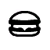 | 21 | Burger Shot |
| 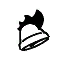 | 22 | Cluckin' Bell |
|  | 23 | Vlad |
|  | 24 | Internet |
|  | 25 | Manny |
|  | 26 | Little Jacob |
|  | 27 | Roman |
|  | 28 | Faustin |
| 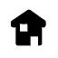 | 29 | Safehouse |
|  | 30 | Taxi Rank |
|  | 31 | Bernie |
|  | 32 | Brucie |
|  | 33 | Unknown Contact |
|  | 34 | Dwayne |
|  | 35 | Elizabeta |
|  | 36 | Gambetti |
|  | 37 | Jimmy Pegorino |
|  | 38 | Derrick |
|  | 39 | Francis |
|  | 40 | Gerry |
| 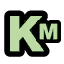 | 41 | Katie |
|  | 42 | Packie |
| 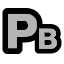 | 43 | Phil Bell |
|  | 44 | Playboy X |
|  | 45 | Ray Boccino |
| 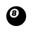 | 46 | 8 Ball |
| 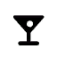 | 47 | Bar |
|  | 48 | Boat Tour |
|  | 49 | Bowling |
|  | 50 | Clothes Shop |
|  | 51 | Club |
| 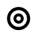 | 52 | Darts |
|  | 53 | Dwayne |
|  | 54 | Date |
|  | 55 | Playboy X |
| 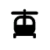 | 56 | Helitour |
| 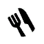 | 57 | Restaurant |
| 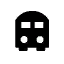 | 58 | Station |
| 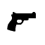 | 59 | Weapons |
|  | 60 | Police Station |
| 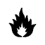 | 61 | Fire Station |
| 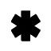 | 62 | Hospital |
|  | 63 | Male |
|  | 64 | Female |
|  | 65 | Finish Line |
| 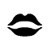 | 66 | Strip Club |
| BLIP_67 | 67 | Console Game |
|  | 68 | Cop Car |
|  | 69 | Dimitri |
| 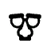 | 70 | Comedy Club |
| 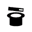 | 71 | Cabaret Club |
|  | 72 | Ransom |
|  | 73 | Cop Chopper |
|  | 74 | Michelle |
|  | 75 | Pay 'n' Spray |
|  | 76 | Assassin |
|  | 77 | Revenge |
|  | 78 | Deal |
| 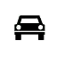 | 79 | Garage |
|  | 80 | Lawyer |
|  | 81 | Trophy |
|  | 82 | Multiplayer Tutorial |
|  | 83 | Station 3 |
|  | 84 | Station 8 |
|  | 85 | Station A |
|  | 86 | Station B |
|  | 87 | Station C |
|  | 88 | Station E |
|  | 89 | Station J |
|  | 90 | Station K |
| 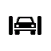 | 91 | Car Wash |
|  | 92 | United Liberty Paper |
|  | 93 | Boss |
|  | 94 | Base |