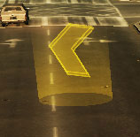
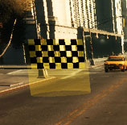
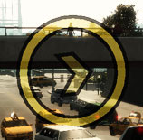
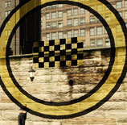
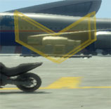
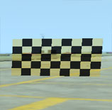
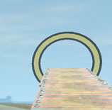

# Checkpoints

| Picture     | ID | Typ         | Description |
|:-----------:|:--:|:-----------:|:-----------:|
|  | 2 | CHECKPOINT_TYPE_ARROW_TUBE | Cylinder with arrow |
|  | 3 | CHECKPOINT_TYPE_FLAG_TUBE | Cylinder with flag |
|  | 4 | CHECKPOINT_TYPE_ARROW_CORONA | Circle with arrow |
|  | 5 | CHECKPOINT_TYPE_FLAG_CORONA | Circle with flag |
|  | 6 | CHECKPOINT_TYPE_ARROW | The arrow itself |
|  | 7 | CHECKPOINT_TYPE_FLAG | The flag itself |
|  | 8 | CHECKPOINT_TYPE_CORONA | The circle itself |