# Weapons

| Icon | ID | Weapon | Model name |
|:----:|:--:|:------:|:----------:|
| 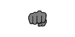 | 0 | Fist | UNARMED |
| 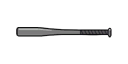 | 1 | Bat | BASEBALLBAT |
| - | 2 | Pool Cue | POOLCUE |
| 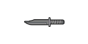 | 3 | Knife | KNIFE |
| 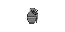 | 4 | Grenade | GRENADE |
|  | 5 | Molotov | MOLOTOV |
| 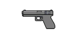 | 7 | Pistol | PISTOL |
| 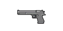 | 9 | Combat Pistol | DEAGLE |
| 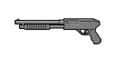 | 10 | Pump Shotgun | SHOTGUN |
| 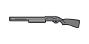 | 11 | Combat Shotgun | BARETTA |
| 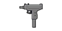 | 12 | Micro-SMG | MICRO_UZI |
| 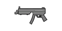 | 13 | SMG | MP5 |
| 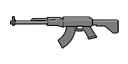 | 14 | Assault Rifle | AK47 |
| 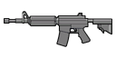 | 15 | Carbine Rifle | M4 |
| 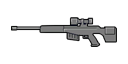 | 16 | Combat Sniper | SNIPERRIFLE |
| 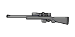 | 17 | Sniper Rifle | M40A1 |
| 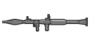 | 18 | RPG | RLAUNCHER |
| - | 19 | 	FTHROWER(eflc) | 	FTHROWER |
